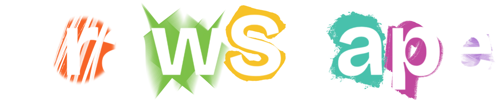

# drawscapeAR

  
  
<strong>The World Is Your Canvas</strong>

  
Hanze Lou, Jadon Magali, Ken Gao, Richie Zheng's Submission for Eureka Hacks '26

## 🚀 Project Features</h2>
<ul>
  <li><strong>Augmented Reality Drawing</strong> using SceneView ARCore integration</li>
  <li><strong>Real-time Hand Tracking</strong> using Google MediaPipe Vision Tasks</li>
  <li><strong>User Authentication System</strong> powered by Firebase Auth</li>
  <li><strong>Cloud Data Storage</strong> using Firebase Firestore</li>
  <li><strong>Profile System</strong> with user stats and drawing history</li>
  <li><strong>Jetpack Compose UI</strong> for fully declarative interface design</li>
  <li><strong>Navigation System</strong> with Compose Navigation</li>
  <li><strong>Permission Handling</strong> using Accompanist Permissions</li>
</ul>

## 🧱 Tech Stack

<h3>Core Framework</h3>
<ul>
  <li>Android (API 26+)</li>
  <li>Kotlin 2.2+</li>
  <li>Jetpack Compose</li>
</ul>

<h3>Architecture & State</h3>
<ul>
  <li>ViewModel (Lifecycle-aware state management)</li>
  <li>Compose State Management</li>
</ul>

<h3>AR & Vision</h3>
<ul>
  <li>ARCore (via SceneView)</li>
  <li>SceneView ARSceneView</li>
  <li>Google MediaPipe Tasks Vision</li>
</ul>

<h3>Backend / Cloud</h3>
<ul>
  <li>Firebase Authentication</li>
  <li>Firebase Firestore</li>
</ul>

<h3>Dependency Injection</h3>
<ul>
  <li>Hilt (Dagger)</li>
</ul>

<h3>Concurrency</h3>
<ul>
  <li>Kotlin Coroutines</li>
  <li>Play Services Coroutine Extensions</li>
</ul>

## ⚙️ Requirements

<h3>Development Environment</h3>
<ul>
  <li>Android Studio Hedgehog / Iguana or newer</li>
  <li>JDK 17–21 (project uses Java 21 compatibility)</li>
  <li>Gradle 8+ with AGP 9.2.0</li>
</ul>

<h3>SDK Requirements</h3>
<ul>
  <li>Compile SDK: 35</li>
  <li>Minimum SDK: 26</li>
  <li>Target SDK: 35</li>
</ul>

<h3>External Services</h3>
<ul>
  <li>Firebase Project (Auth + Firestore enabled)</li>
  <li>Google Cloud API Key (for ARCore if required)</li>
</ul>

<h3>Navigation & UI</h3>
<ul>
  <li>Jetpack Navigation Compose</li>
  <li>Material 3 Compose UI</li>
  <li>Accompanist Permissions</li>
</ul>

## ▶️ How to Run the Project

<h3>1. Clone Repository</h3>
<pre>
git clone https://github.com/BestCodey/dreamscapeAR.git
cd dreamscapeAR
</pre>

<h3>2. Open in Android Studio</h3>
<ul>
  <li>Open Android Studio</li>
  <li>Select <strong>Open Existing Project</strong></li>
  <li>Choose the project folder</li>
</ul>

<h3>3. Sync Gradle</h3>
<ul>
  <li>Allow Gradle sync to complete</li>
  <li>Resolve any dependency downloads</li>
</ul>

<h3>4. Configure Firebase</h3>
<ul>
  <li>Add <code>google-services.json</code> into <code>/app</code></li>
  <li>Enable Authentication (Email/Google if needed)</li>
  <li>Enable Firestore Database</li>
</ul>

<h3>5. API Key Setup (Optional ARCore)</h3>

Ensure ARCore API key is correctly set in:

<pre>
manifestPlaceholders["ARCORE_API_KEY"]
</pre>

<h3>6. Build & Run</h3>
<pre>
./gradlew clean
./gradlew assembleDebug
</pre>

Or press ▶ Run in Android Studio.

## 📌 Future Improvements
<ul>
  <li>Music landmark integration</li>
  <li>Special effects for drawings</li>
  <li>Interactive drawings that can open up to experiences</li>
</ul>
